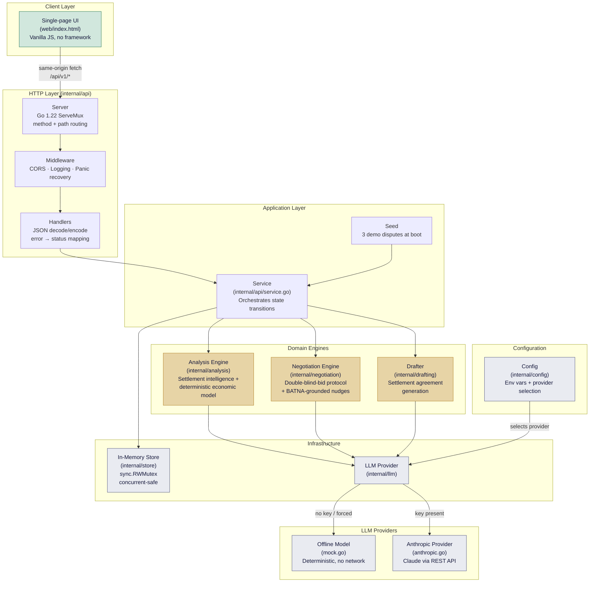
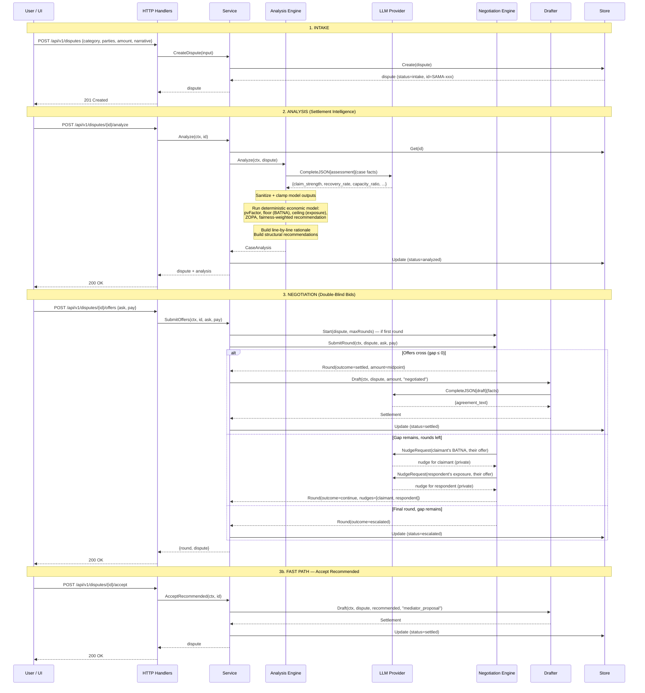
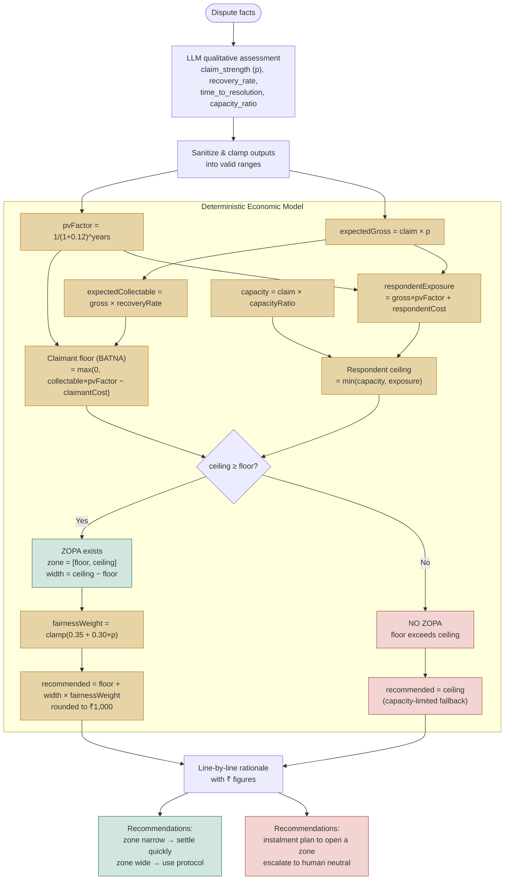
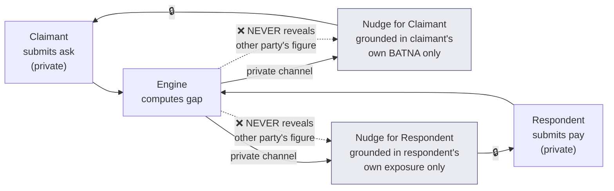

# Architecture

## Component Diagram

## Sequence Diagram: Full Dispute Lifecycle

## Functional Flow: Economic Model

## Data Flow: Confidential Nudge Protocol

## Technology Choices

| Layer | Choice | Rationale |
|---|---|---|
| Language | Go 1.22 | stdlib-only server, method routing, strong concurrency, single binary |
| External deps | Zero | Entire dependency tree is Go stdlib; only outbound HTTP call is to Anthropic |
| UI | Vanilla JS, single file | No build step, no node_modules, serves from `web/index.html` |
| Storage | In-memory (sync.RWMutex) | Appropriate for a demo / take-home; swap for Postgres behind an interface |
| LLM | Provider interface | `MockProvider` for deterministic offline; `AnthropicProvider` for live |
| Config | Environment variables | 12-factor; zero-config default boots offline with seed data |
